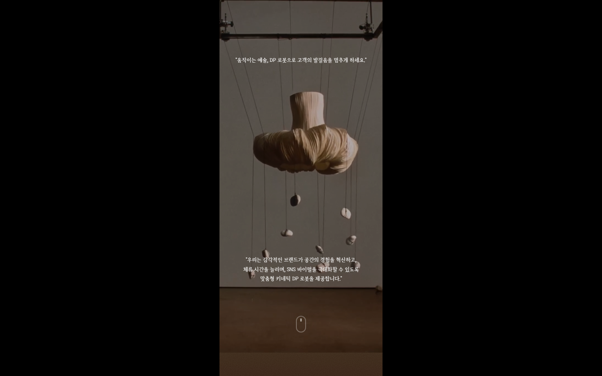
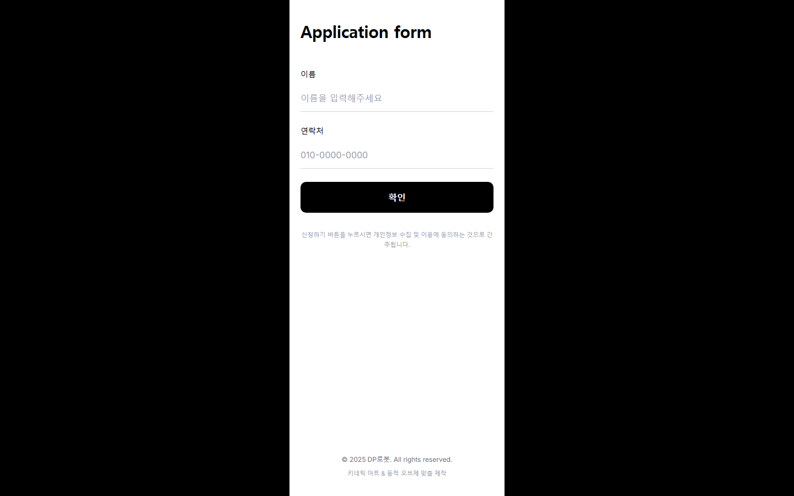

# DP로봇 — 키네틱 아트 & 동적 오브제 랜딩페이지 (v2)

**"움직이는 예술, DP 로봇으로 고객의 발걸음을 멈추게 하세요."**
브랜드 무드에 맞춘 맞춤형 키네틱 아트(움직이는 오브제) 제작 서비스의 원페이지 랜딩페이지입니다.

- **Stack**: Next.js 14 (App Router) · TypeScript · Tailwind CSS · Framer Motion
- **폼 연동**: 신청 폼 → [SheetDB](https://sheetdb.io/) API로 클라이언트에서 직접 전송

> [`dp-robot-landing`](https://github.com/mnunu123/dp-robot-landing)(v1)의 후속 버전입니다.
> 아래 "v1과의 차이"를 참고하세요.

## 실제 구동 화면

`npm run dev`로 직접 실행한 뒤 캡처한 실제 화면입니다 (모바일 390px 폭 기준).


*히어로(`Hero`) — 동영상 배경 위에 "움직이는 예술, DP 로봇으로 고객의 발걸음을 멈추게 하세요" 한 줄로 압축된 카피.*


*신청 폼(`ApplicationForm`) — 이름/연락처 입력 후 SheetDB API로 바로 전송.*

## v1과의 차이

| 항목 | v1 | v2 |
| --- | --- | --- |
| 폼 제출 방식 | Next.js API Route(`/api/submit-to-sheet`) → Google Apps Script | 클라이언트에서 **SheetDB API로 직접 전송** — 서버 라우트/환경변수 불필요 |
| 분석 도구 | Google Analytics(`@next/third-parties`) 포함 | 제거됨 |
| 히어로 카피 | 두 줄로 분리된 메시지("움직이는 예술" + 별도 설명) | 한 문장으로 압축, "DP 로봇" 브랜드명을 카피에 직접 명시 |
| 나머지 섹션 구성 | 동일 (Hero → BrandChallenge → BrandIntro → DeadSpace → BrandShowcase → Gallery → KineticTrend → BrandMessage → CustomMade → ApplicationForm) | 동일 |

즉 v2는 **백엔드 의존성을 없애고(서버 라우트·GA 제거) 프론트엔드만으로 배포 가능하게** 단순화한
버전입니다. SheetDB 무료 플랜은 요청 수 제한이 있어 실제 운영 트래픽 규모에 따라 v1의
Apps Script 방식이 더 적합할 수도 있습니다.

## 페이지 구성

| 섹션 | 컴포넌트 | 내용 |
| --- | --- | --- |
| 1 | `Hero` | 동영상 배경 히어로 |
| 2 | `BrandChallenge` | 브랜드가 겪는 문제(정적인 공간) 제시 |
| 3 | `BrandIntro` | 젠틀몬스터 / 아더에러 등 레퍼런스 브랜드 소개 |
| 4 | `DeadSpace` | "멈춰있는 공간은 죽은 공간" 메시지 섹션 |
| 5 | `BrandShowcase` | 브랜드 링크 카드 |
| 6 | `Gallery` | 해외 키네틱 아트 사례 갤러리 |
| 7 | `KineticTrend` | 키네틱 아트 트렌드/사례 소개 |
| 8 | `BrandMessage` | 브랜드 메시지 |
| 9 | `CustomMade` | 맞춤 제작 안내 |
| 10 | `ApplicationForm` | 이름/연락처 신청 폼 (SheetDB로 저장) |

## 실행

```bash
npm install
npm run dev      # http://localhost:3000
npm run build
npm start
```

SheetDB 주소는 `src/components/ApplicationForm.tsx` 상단의 `GOOGLE_SHEET_API_URL` 상수에
하드코딩되어 있습니다 — 다른 시트를 쓰려면 이 값을 교체하세요.
